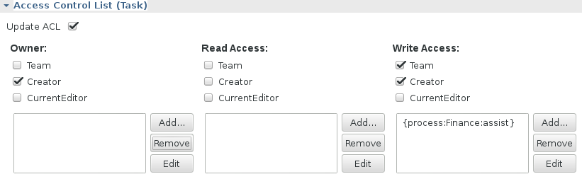

# The Team Interceptor

The EJB Interceptor class *org.imixs.marty.ejb.TeamIntercepter* provides a mechanism to compute the orgunits a user belongs to. An orgunit can either be a 'Process' or a 'Space'. The Result is put into the EJB contextData which is
 read by the [DocumentService](http://www.imixs.org/doc/engine/documentservice.html) to grant access by dynamic computed user roles.

An orgunit in the Imixs-Marty project contains 3 different roles 

* Manager - responsible for a single orgunit
* Team - team members assigned to an orgunit
* assist - optional list of users to assist this orguinit

The syntax for the user roles computed by the TeamInterceptor is :

    {ORGUNIT:NAME:ROLE}

For example a user with the role 'assist' in the process named 'Finance' is computed as:

    {process:Finance:assist}
 
### Generic Roles 
 
If a user is at least member of one of the roles associated with an orgunit, the generic orgunit role '*member*' is added: 

    {process:Finance:member}

In addition generic roles are computed independent from a specific orgunit. So as a result it is also possible to ask, if the user is member of a role associated with an orgunit independent form the orgunit itself. In this case the name of the orgunit is skipped. 

Back to the example above, if a user is assigned with the role 'assist' in the process named 'Finance' the complete list of role names computed by the _TeamInterceptor_ is:

    {process:Finance:assist}
    {process:Finance:member}
    {process:member}
    {process:assist}

### Roles declared by Name or UniqueID

A role generated by the _TeamInterceptor_ are computed by the name of a orgunit as also by the _$uniqueid_ of the orgunit:

    {process:Finance:assist}
    {process:8838786e-6fda-4e0d-a76c-5ac3e0b04071:assist}

## Modeling

The custom orgunit role names can be used in a BPMN 2.0 model.  

In this example the read access for a task is extended to the orgunit role '{process:Finance:assist}'.

In combination with the [TeamRoleWildcardAdapter](./teamrolewildcardadapter.md) the orgunit role can be also computed automatically. There for the wildcard '?' can be used. 

The associated orgunit will be computed by the TeamRoleWildcardAdapter.

## Configuration
    
The interceptor can be enabled by the deployment descriptor of the *DocumentService*. See the following example for a ejb-jar.xml configuration

    <assembly-descriptor>
		<!-- TeamInterceptor -->
		<interceptor-binding> 
		    <description>Intercepter to add orgunit-role mapping into EJB Context Data</description> 
		    <ejb-name>DocumentService</ejb-name> 
			<interceptor-class>org.imixs.marty.ejb.TeamInterceptor</interceptor-class> 
		</interceptor-binding>
	</assembly-descriptor>
  
 
 