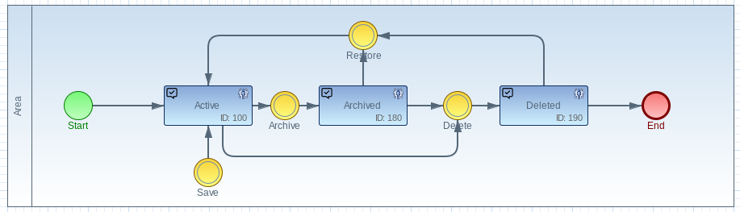

# The TeamPlugin

The Marty TeamPlugin organizes the hierarchical order of a workitem between
processes, spaces and workitems and computes the users associated with an orgunit.  
 
     org.imixs.marty.team.TeamPlugin

A WorkItem is typically assigned to one or more orgunits. These references are stored in the item `$UniqueIDRef`. 
TeamPlugin automatically computes the references and stores the information into the items 
`process.ref` and `space.ref` which containing only uniqueIDs of the corresponding orgunit type.

The items `process.ref` and `space.ref` can also be modified by the workflow model or a custom business logic.
 
The Marty TeamPlugin computes additional workflow properties:

  
| Item       		| Type      | Description                               						|
|-------------------|-----------|-------------------------------------------------------------------|
|space.team   		| names		| current team members of an associated space orgunit. 				|
|space.manager		| names   	|current managers of an associated space orgunit.					|
|space.assist		| names   	|current assists of an associated space orgunit. 					|
|space.name			| text		|name of  an associated space orgunit. 								| 
|space.rref			| text		|$uniqueID  of an associated space orgunit. 						| 
|process.team		| names		|current team members of an associated process orgunit. 			| 
|process.manager	| names		|current managers of an associated process orgunit. 				| 
|process.assist		| names		|current assists of an associated process orgunit. 					| 
|process.name		| text		|name of  an associated process orgunit. 							| 
|process.ref		| text		|$uniqueID  of an associated process orgunit.						| 
 
The name items can be used in ACL settings or mail settings.
 
The item `process.ref`  and `space.ref` are optional and can update the current $uniqueIDs for referenced orgunits. 
The Plug-in updates the item `$UniqueIDRef` automatically if these properties are filled.

### Evaluate a Orgunit

If the workflow result message of an Imixs-Event contains a space or process reference the plug-in will update the references

Example:

	<item name="space">...</item>
	<item name="process">...</item>

## Archived Spaces

Spaces can optional be archived. Archived spaces can be still managed by the orgunit owner. 

The teamlist of an archived space is still updated into the workitem. But the [Team Interceptor](../concepts/teaminterceptor.html) will ignore archived spaces.  