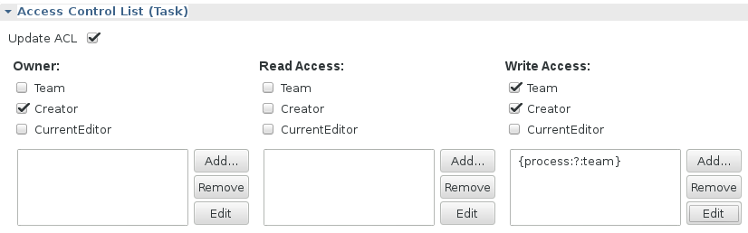

# The TeamRoleWildcardAdapter

The `TeamRoleWildcardAdapter` can be used to compute team roles using the '?' wildcard.
 
In combination with the [TeamInterceptor](./teaminterceptor.md) the `TeamRoleWildcardAdapter` computes a Orgunit Roles associated with the current workitem. To add the team role for the orgunit currently associated with the workitem into the ACL the following role definition can be added:

	{process:?:team}
	

The _TeamRoleWildcardAdapter_ will lookup the associated process orgunit and compute the role name (e.g. from the orgunit 'Finance'):

    {process:8838786e-6fda-4e0d-a76c-5ac3e0b04071:team}

**Note:** The `TeamRoleWildcardAdapter` computes the role based on the uniqueID only.  